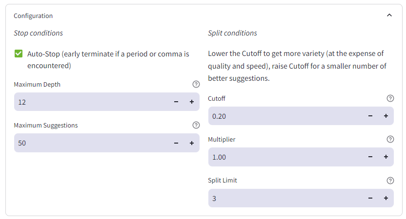

# The LLooM

Leverage raw LLM logits to weave the threads probability a few tokens at a time.

The problem with straight greedy decoding is that due to the self-recursive nature of LLMs, if there's a high-probability token hidden behind a low-probability one then greedy wont find it.

Conceptually this idea is similar to beamsearching, tracking multiple candidates at once, but with a human in the loop and unlimited beams.

# News

*06/02* Released **v0.3** with [vLLM](https://github.com/vllm-project/vllm) support and a quality of life improvement: if a suggestion beam starts with a stop token, it will be allowed to continue.

# Screenshot


# Using

Give the LLooM a starting prompt, or change the Story any time by directly editing in the top input area and pressing Ctrl+Enter.

Click ➡️ beside a suggestion to accept it, or edit the suggestion (press Enter when done) in-line before accepting.

*Have fun!*

# Launching

## Prepare environment

`pip3 install requests graphviz streamlit`

`sudo apt-get install -y graphviz`

## Usage with vLLM

Download an appropriate GPTQ or AWQ quant for your system such as [study-hjt/Meta-Llama-3-70B-Instruct-GPTQ-Int4](https://huggingface.co/study-hjt/Meta-Llama-3-70B-Instruct-GPTQ-Int4).

Launch a vllm openAI server:

```
python3 -m vllm.entrypoints.openai.api_server --model ~/models/study-hjt-Meta-Llama-3-70B-Instruct-GPTQ-Int4/ --enable-prefix-cache
```

Remember to add `--tensor-parallel-size <N>` if you have multiple GPUs.

Then launch the frontend with `VLLM_API_URL` set to the host and port of the server:

```
LLAMA_PIPELINE_REQUESTS=6 VLLM_API_URL=http://127.0.0.1:8000 streamlit run lloom.py
```

Tweak `LLAMA_PIPELINE_REQUESTS` up until it stops being faster (if you have powerful GPUs).

### If you 48GB VRAM and want to Fit Llama3-70B-GPTQ model

Add `--enforce-eager --max-model-len 2048 --gpu_memory_utilization 1.0` to vllm server command line.

### If you have P100

Use [vllm-ci](https://github.com/sasha0552/vllm-ci)

`export VLLM_ATTENTION_BACKEND=XFORMERS` to force xformers.

Add `--dtype half` to vllm server command line.

If you get the "Cannot convert f16 to f16 crash" either remove `--enable-prefix-cache` or build triton from source with the patches from the vllm-ci repo.

## Usage with llama.cpp

Download an appropriate quant for your system from [dolphin-2.9-llama3-70b-GGUF](https://huggingface.co/crusoeai/dolphin-2.9-llama3-70b-GGUF)

Launch a llama.cpp server with a good Llama3-70B finetune:

```
./server -m ~/models/dolphin-2.9-llama3-70b.Q4_K_M.gguf -ngl 99 -sm row --host 0.0.0.0 -c 8192 --log-format text
```

| :exclamation: Note that you cannot use -fa as this results in all the logits being `null` and its strongly discouraged to launch with any kind of parallelism because this both reduces available context size and seems to break the KV caching so performance suffers.  |
|-----------------------------------------|


Then launch the frontend with `LLAMA_API_URL` set to the host and port of the server:

| :exclamation:  LLooM makes a large number of network calls and is latency sensitive, make sure the llama.cpp server is running on the same machine or LAN as the frontend to avoid degraded performance.  If you cannot avoid going over a high-latency, connection setting `LLAMA_PIPELINE_REQUESTS=2` should improve performance. |
|-----------------------------------------|

```
LLAMA_API_URL=http://127.0.0.1:8080 streamlit run lloom.py
```

## Usage with OpenAI

Launch the frontend with `OPENAI_API_KEY`

```
OPENAI_API_KEY=sk-... streamlit run lloom.py
```

Model is currently hard-coded to `gpt-3.5-turbo`.

# Configuration

You can open the Configuration dropdown at the top at any time to adjust parameters.



The parameters are grouped into two sections: when to stop, and when to split.

## Stop Conditions

`Auto-Stop` Early-terminate suggestion beams when a "." or "," character in encountered.

`Max Depth` The maximum number of tokens a suggestion beam can have. Note that if you disable the Auto-Stop condition, then all beams will have exactly this number of tokens.

`Maximum Suggestions` The maximum number of completed suggestion beams to return (this can be really useful to limit run-time if the model is slow).

## Split Conditions

`Cutoff` The minimum token probability (0.0 - 1.0) to spawn a new thread.

`Multiplier` cutoff per token slope (1.0: fixed cutoff, <1.0 cutoff decreases with depth, >1.0 cutoff increases with depth)

`Split Limit` the maximum number of times a suggestion beam can split (analogous to beamsearch with top-k)
